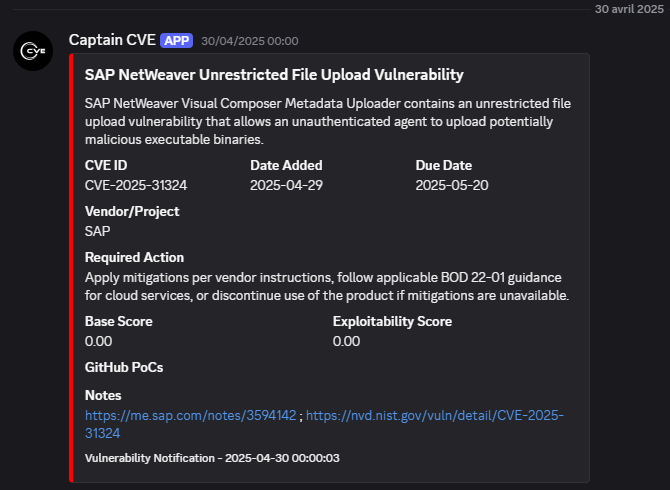
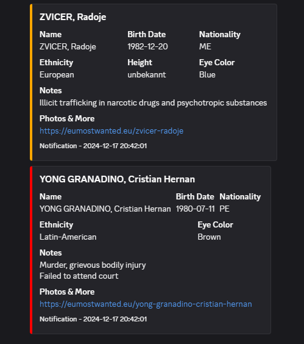
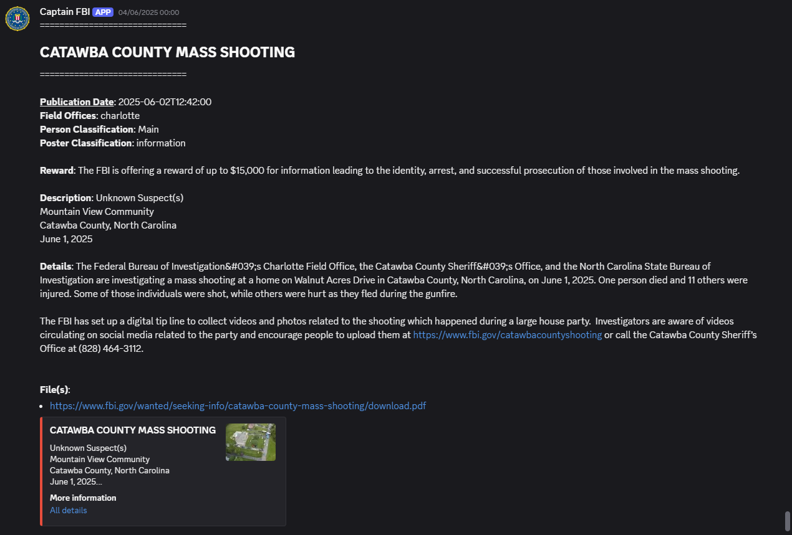
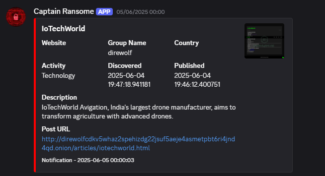
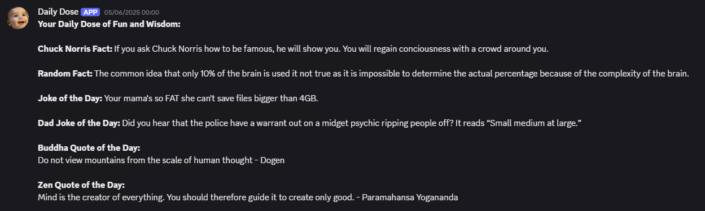

[](https://doi.org/10.5281/zenodo.15784648)
[](https://github.com/gl0bal01/discord-feed-watchers/releases)
[](https://github.com/gl0bal01/discord-feed-watchers/actions/workflows/security-quality.yml)
[](LICENSE)

# Discord Feed Watchers

This project is a collection of PHP scripts that monitor external feeds and send notifications to Discord channels via webhooks.

Current release: [`v1.0.0`](https://github.com/gl0bal01/discord-feed-watchers/releases/tag/v1.0.0)

**Tags:** `discord`, `webhooks`, `feed-monitoring`, `cve`, `ransomware`, `fbi`, `europol`, `php`, `security-alerts`

## [CVE Watchlist](cve)
Monitors a CVE feed for new vulnerabilities and sends notifications.



## [Europol Watchlist](europol)
Monitors Europol's Most Wanted feed for new additions and sends notifications.



## [FBI Watchlist](fbi)
Monitors the FBI's Most Wanted feed for new additions and sends notifications.



## [Ransomware Watchlist](ransomware)
Monitors a ransomware feed for new victims and sends notifications.



## [Daily Fun](fun)
Sends a daily random joke/fact/quote message.



## Requirements

- PHP `>= 8.1`
- PHP `curl` extension enabled
- `make` (optional, but recommended)

Debian/Ubuntu example:

```bash
sudo apt-get update
sudo apt-get install -y php php-curl make
```

## Installation

1. **Clone the repository**

```bash
git clone https://github.com/gl0bal01/discord-feed-watchers.git
cd discord-feed-watchers
```

2. **Configure webhook URLs (recommended: environment variables)**

```bash
export CVE_WEBHOOK_URL="https://discord.com/api/webhooks/..."
export EUROPOL_WEBHOOK_URL="https://discord.com/api/webhooks/..."
export FBI_WEBHOOK_URL="https://discord.com/api/webhooks/..."
export FUN_WEBHOOK_URL="https://discord.com/api/webhooks/..."
export RANSOMWARE_WEBHOOK_URL="https://discord.com/api/webhooks/..."
```

If you do not want environment variables, use a local config file:

- Copy `src/config/config.example.php` to `src/config/config.php`
- Replace the placeholder values with your webhook URLs

`src/config/config.php` is git-ignored and must never be committed.

## How To Get A Discord Webhook URL

1. Open your Discord server: **Server Settings** -> **Integrations**
2. Click **Webhooks** -> **New Webhook**
3. Name it and choose a channel
4. Copy the webhook URL
5. Put it in an environment variable **or** in `src/config/config.php`

## Running The Scripts

### With Makefile (recommended)

```bash
make check-deps
make lint
make run-cve
make run-europol
make run-fbi
make run-fun
make run-ransomware
```

Run all watchers sequentially:

```bash
make run-all
```

### Without Makefile

```bash
php cve/cve.php
php europol/europol.php
php fbi/fbi.php
php fun/fun.php
php ransomware/ransomware.php
```

## Cron Setup

Cron runs with a minimal environment. If you use environment variables, define them in your crontab or service unit. Shell `export` values from interactive sessions are usually not available to cron.

Example crontab:

```cron
PATH=/usr/local/sbin:/usr/local/bin:/usr/sbin:/usr/bin:/sbin:/bin
CVE_WEBHOOK_URL=https://discord.com/api/webhooks/...
EUROPOL_WEBHOOK_URL=https://discord.com/api/webhooks/...
FBI_WEBHOOK_URL=https://discord.com/api/webhooks/...
FUN_WEBHOOK_URL=https://discord.com/api/webhooks/...
RANSOMWARE_WEBHOOK_URL=https://discord.com/api/webhooks/...

0 * * * * cd /path/to/discord-feed-watchers && make run-cve >> cve/logs/cron.log 2>&1
15 * * * * cd /path/to/discord-feed-watchers && make run-europol >> europol/logs/cron.log 2>&1
30 * * * * cd /path/to/discord-feed-watchers && make run-fbi >> fbi/logs/cron.log 2>&1
0 9 * * * cd /path/to/discord-feed-watchers && make run-fun >> fun/logs/cron.log 2>&1
45 * * * * cd /path/to/discord-feed-watchers && make run-ransomware >> ransomware/logs/cron.log 2>&1
```

If you prefer file-based configuration, `src/config/config.php` also works with cron (no extra env vars needed).

## Expected First-Run Behavior

- On first run, each watcher may send multiple notifications for existing items in the upstream feed.
- After that, only new items are sent.
- State files are created (for example `processed_*` and `uids`) and used for de-duplication.
- Each script uses a lock file to prevent concurrent duplicate runs.

## Troubleshooting

- **Error:** `Missing webhook URL for ...`
  - Set the corresponding environment variable (`*_WEBHOOK_URL`) or define it in `src/config/config.php`.
- **Error:** `The cURL extension is not installed or enabled.`
  - Install/enable `php-curl`, then verify with `php -m | grep -i curl`.
- **Error:** `Failed to append file:` or `Failed to write file:`
  - Fix write permissions on project directories/state files for the user running PHP/cron.
- **Cron runs but no Discord messages**
  - Confirm webhook variables are set in crontab/service and that `PATH` includes the PHP binary.

## Data Sources

| Watcher | Upstream feed | Trust model |
|---------|---------------|-------------|
| CVE | `https://kevin.gtfkd.com/kev` (default) — community proxy enriching the CISA KEV catalog with NVD scores and PoC links | Third-party. For an authoritative, un-enriched source set `CVE_FEED_URL` to CISA's official KEV JSON (`https://www.cisa.gov/sites/default/files/feeds/known_exploited_vulnerabilities.json`); NVD-score colouring and PoC fields are then omitted. |
| Europol | OpenSanctions `eu_europol_wanted` dataset | Official OpenSanctions mirror. |
| FBI | `https://api.fbi.gov/@wanted` | Official FBI API. |
| Ransomware | `https://api.ransomware.live/feed` (RSS; the legacy JSON `recentvictims` endpoint was retired upstream) | Third-party aggregator. RSS carries victim name, group, country, description, post link and screenshot; richer JSON fields (website, activity, infostealer) are unavailable on the free tier. |
| Fun | uselessfacts / jokeapi / icanhazdadjoke | Third-party, low-trust (content only). |

All feeds are fetched over HTTPS with TLS verification. Feed content is treated as untrusted: Discord mentions are disabled and embed thumbnail/screenshot URLs are HTTPS-validated before use.

### Optional environment variables

| Variable | Default | Purpose |
|----------|---------|---------|
| `CVE_FEED_URL` | community proxy | Override the CVE data source (e.g. point at the official CISA feed). |
| `RANSOMWARE_HIGHLIGHT_COUNTRY` | `FR` | ISO country code highlighted in a distinct colour in ransomware alerts. |

## Security / Operations Notes

- All network calls enforce HTTPS and TLS verification.
- Webhook payloads disable Discord mentions (`@everyone`, roles, users) by default.
- Each watcher enforces a single active instance with a process lock.
- State files are written with file locking to avoid corruption.
